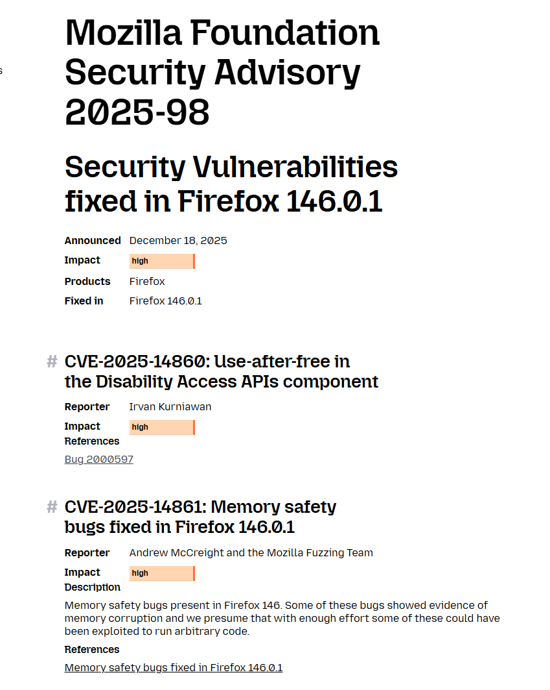
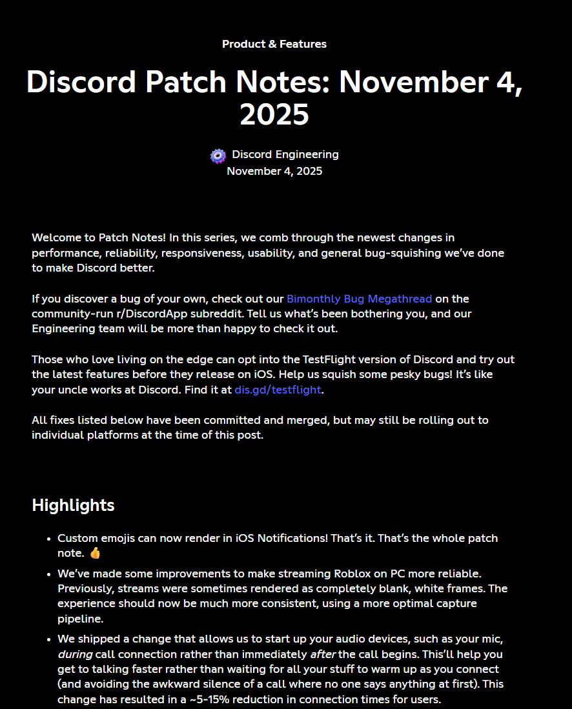
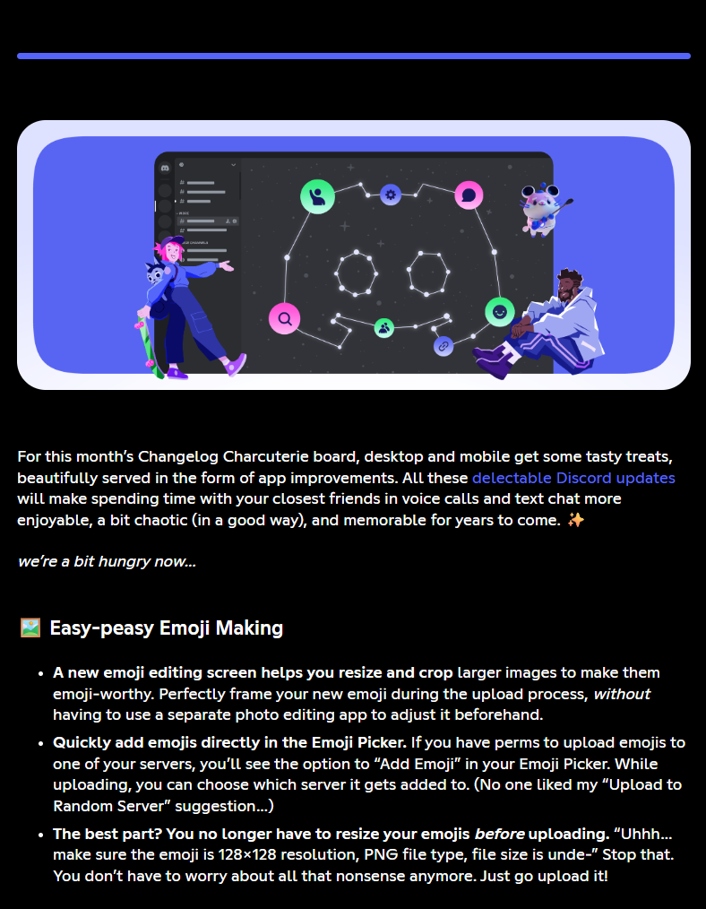
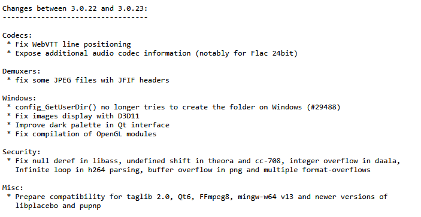
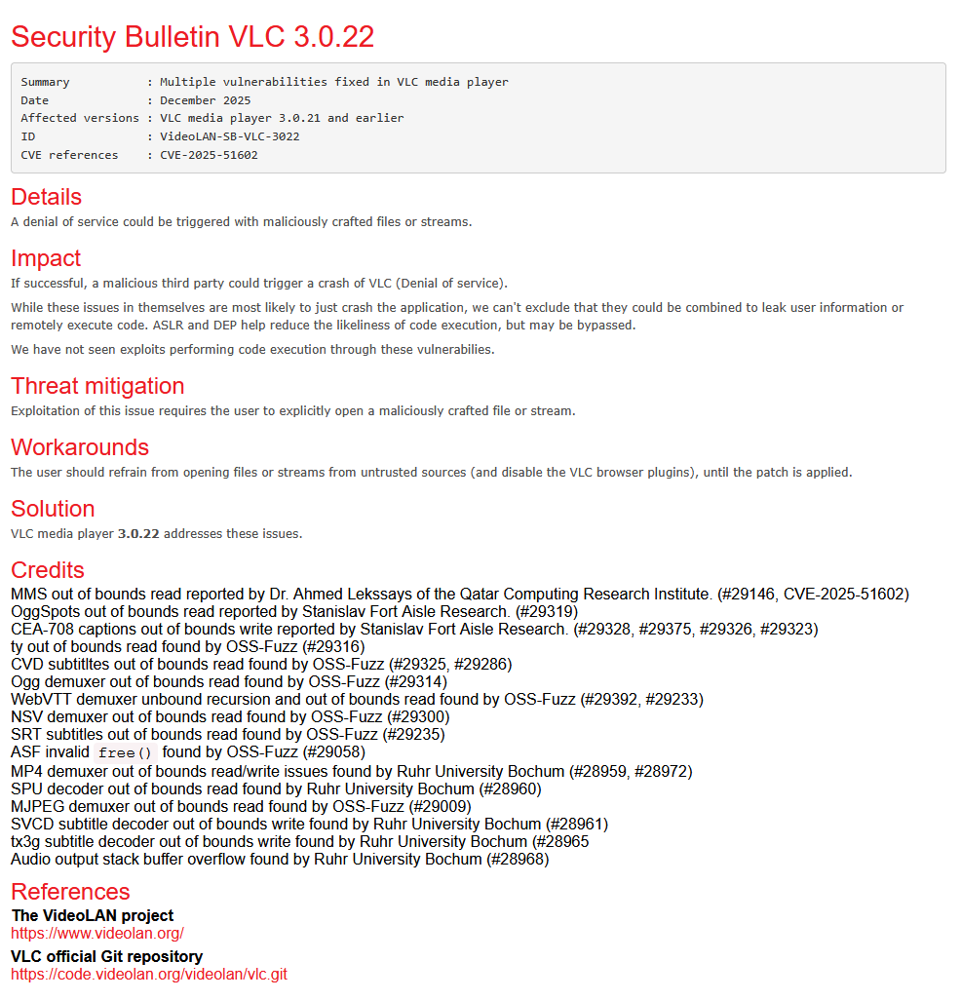
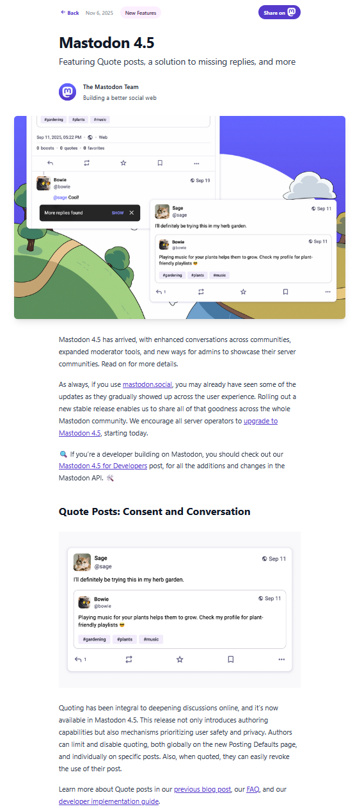
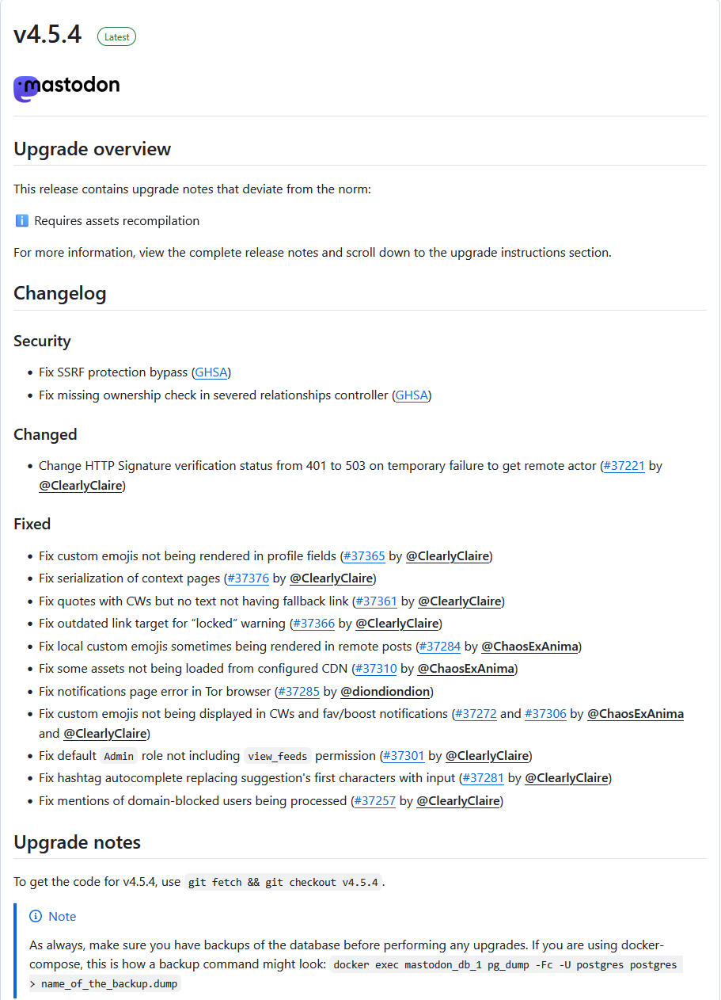

Egal ob die Hinweise für Entwickler oder Anwender gedacht sind. Beide sind leider bei den meisten Entwicklern in Englisch verfasst.

## Firefox

### Realese Notes

[Firefox Release Notes](https://www.firefox.com/de/firefox/notes/)

### Security

[Security Fixes](https://www.mozilla.org/en-US/security/advisories/)

## Discord

### Realese Notes

[Patch Notes](https://discord.com/tags/patch-notes)

### Changelog

[Changelog](https://discord.com/tags/changelog)

## VLC Media Player

### Release Notes

### Changelog

## Security

[Security](https://www.videolan.org/security/)

## Mastodon

### für Nutzer

[Changelog für Nutzer](https://blog.joinmastodon.org/tags/changelog/)

### für Entwickler

[Changelog für Entwickler](https://github.com/mastodon/mastodon/releases)

