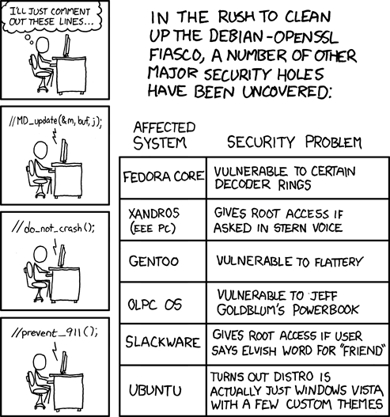

# Software Hygiene

# Einleitung

Software‑Hygiene bedeutet, die auf Geräten installierte Software bewusst zu verwalten, zu pflegen und unnötige Programme zu entfernen. Ziel ist es, die Angriffsfläche zu verkleinern, Sicherheitsrisiken zu reduzieren und die Stabilität sowie Performance der Geräte zu verbessern. Hier wird nun erklärt, warum das wichtig ist, wie Angriffe typischerweise ablaufen, welche Risiken besonders relevant sind und welche konkreten, leicht umsetzbaren Maßnahmen Privatanwenderinnen und ‑anwender ergreifen können.

# Die Angriffsfläche verstehen

Was ist die Angriffsfläche
Die Angriffsfläche (engl. attack surface) umfasst alle Komponenten eines Systems, über die ein Angreifer potenziell eindringen kann: installierte Programme, Dienste, Treiber, Browser‑Plugins, Hintergrundprozesse und Netzwerkdienste. Jede zusätzliche Anwendung oder Bibliothek vergrößert diese Fläche.

## Warum viele Programme problematisch sind

Mehr Code = mehr Fehler: Programme werden immer Komplexer und bestehen aus vielen Zeilen Code; Fehler und Schwachstellen können sich einschleichen.
Eine Schwachstelle ist wiederum ein Fehler in einer Softwarem durch die ein Computer angreifbar wird.

> https://xkcd.com/424/

Was ggf. wie eine leichte, einfache Software aussieht, wie bspw. den VLC-Player hat in Wahrheit über einer Millionen Zeilen Code von vielen verschiedenen Entwicklern. Hier den Überblick für einzlene zu behalten ist nahezu unmöglich. Alles ist über viele Dateien verteilt was es zwar übersichtlicher macht, jedoch eine Kontrolle nicht wirklich erleichtert. Zudem bauen viele Anwendungen auf sogenannten Bibliotheken bzw. Programmen von anderen auf die ebenfalls komplexit Komplexität einbringen.

[Richard C. G. Øiestad](https://commons.wikimedia.org/wiki/File:VLC_Icon.svg) · [GPL](http://www.gnu.org/licenses/gpl.html)

# Supply‑Chain‑Risiken

Wie vorhin in [weiter oben](#warum-viele-programme-problematisch-sind) erklärt ist eine Anwendung meist komplex. Sie basiert auf vierschiedenen anderen Bibliotheken und Entwicklungen anderer, das reduziert zwar den Arbeitsaufwand erheblich man ist jedoch auf die Arbeit dritter angewiesen. Daher ist es auch nicht verwunderlich wenn Angreifer dies auch als Ziel entdeckt haben: Es handelt sich hierbei um sogenannte **Supply‑Chain‑Angriffe**. Diese zielen nämlich nicht direkt auf das Endgerät ab, sondern auf Komponenten, Bibliotheken oder Build‑Prozesse, die viele Anwendungen verwenden. Wird eine zentrale Komponente kompromittiert, kann Schadcode in zahlreiche Programme gelangen. Deshalb ist es wichtig, nicht nur die eigenen Programme, sondern auch deren Herkunft und Vertrauenswürdigkeit zu beachten.

## Unnötige Dienste:

Auch Programme bzw. Dienste die typischerweise auf dem Desktop im Hintergrund laufen bieten eine weitere Einfallstore.
Hintergrunddienste, die nicht benötigt werden, bieten zusätzliche Einfallstore. Gerade unter Windows schleichen sich in Installtionen verschiedenste Programme ein die einen Eintrag in den Autostart legen und entsprechend jedes mal starten wenn der Rechner startet.
Auch werden bestimmte Anwendungen erst gestartet wenn ein bestimmtes Ereignis eintritt. Gerade hier schleichen sich verschiendste Schadsoftware in den Rechner ein, bzw. sorgen dafür nicht mehr gelöscht werden zu können.

https://www.heise.de/tipps-tricks/Autostart-aufraeumen-und-Windows-Start-beschleunigen-3929316.html?hg=2&hgi=1&hgf=false

## Browser Addons

Auch Browser Plugins können zur Gefahr werden. Da die meisten Extensions bzw. Erweiterungen für ihre berechtigte bzw. gewünschte Funktion teilweise weitreichende Berechtigungen benötigt, ist es umso schwerer Erweiterungen diese von Erweiterungen zu unterscheiden die diese Berchtigungen ausnutzen um den Nutzer zu schaden. Aber auch das ändern der Suchmaschine oder Startseite von Addons führt dazu, dass teilweise Dubiose Firmen informationen über den Suchverlauf und entsprechend auch über Interessen erhalten. Auch können Cookies entwendet werden oder neue verteilt werden, über letzteres kann dann Schadcode den Computer erreichen.

https://www.kaspersky.de/blog/dangers-of-browser-extensions/29283/

# Berechtigungen von Anwendungen

Was im Bezug auf Browser Plugins gilt, gilt insbesondere auch für Anwendungen und Apps. In erste Linie sind (unbegründete) Berechtigungen die man typischerweise aus mobilen Betriebssystemen kennt ein Datenschutzrisiko, bzw. können dafür sorgen, dass z. B. Fotos oder Geolokalisationsdaten bei Firmen und Personen landen die diese für die Bereitstellung des Services, der App oder Anwendung garnicht benötigen. Jedoch sind Berechtigungen auch für Angreifer wichtig die diese teilweise benötigten um Schaden am System anzurichten. Auch bei Betriebssystemen für den Desktop sind können Berechtigungen dafür sorgen, dass die Privatsphäre verletzt wird zumden. So können unter Umständen Kamera und Tonaufnahmen unbemerkt erstellt werden. Es können mithilfe des freigegeben Standard, Bewegungsprofile bzw. Rückschlüsse auf den Wohnort, den Arbeitsort, bzw. auf Routinen gemacht werden.

## Beispiele

### Browser Addons

Im Juli 2025 wurde bekannt das ingesamt 18 Erweiterungen von Chrome, die teilweise von Google verifiziert waren und über 2 Millionen Nutzer hatten alle besuchten Webseiten, inklusive Tracking IDs an einen Webserver gesendet hat und ggf. auf eine andere Webseite weitergeleitet hatte. Darunter sind unter anderem ein Farb-Picker, verschiedene Unlocker/VPNs für Discord, Tiktok und eine Sucherweiterung mit ChatGPT. Die Anwendungen bringen auf den ersten Blick ihre Funktionen mit und waren lange Zeit auch Problematisch. Erst einem automatischen Update, das unbemerkt die Funktion einführte wurden diese Webseiten weitergeleitet (Warum man dennoch Updates trotz potenzieller Gefahren automatisch installieren sollte, wird in [Software Hygiene]()). Bei diesen Angriff handelt es sich um ein sogenannten Man-in-the-Middle Angriff, der Angreifer hat also vollständigen Zugriff auf den Datenverkehr zwischen dem Nutzer und dem Browser.

https://www.crowdstrike.com/en-us/cybersecurity-101/exposure-management/browser-extensions/
https://www.crowdstrike.com/en-us/blog/latam-ecrime-malware-evolution-2024/
https://www.zscaler.com/blogs/security-research/kimsuky-deploys-translatext-target-south-korean-academia#technical-analysis
**https://www.koi.ai/blog/google-and-microsoft-trusted-them-2-3-million-users-installed-them-they-were-malware**
https://arxiv.org/html/2503.04292v1
https://www.ndr.de/nachrichten/netzwelt/Nackt-im-Netz-Millionen-Nutzer-ausgespaeht,nacktimnetz100.html
**https://www.kuketz-blog.de/wot-addon-wie-ein-browser-addon-seine-nutzer-ausspaeht/**

### Supply Chain Attacken

Im März 2018 wurden Systeme von Piriform von Angreifern übernommen, dem Hersteller der von Avast aufgekauft und das Tool "CCleaner entwickelt. Dabei hatten Angreifer sich über eine Remote-Desktop-Konto zugriff zu einen Entwickler-PC verschafft. Von dort haben sie sich weiter im den Netzwerken der Firma augekundschaftet und die Updateserver infiltriert und bei einer bestimmten Version des CCleaners ein Update so verändert, dass des den Angreifern ermöglichte Code bzw. Maleware aus der Ferne auszuführen. Es hat insgesamt 2,27 Millionen Nutzer betroffen die innerhalb eines Zeitraums 9 Tagen diese Update installiert hatten. Zwar hat sich herausgestellt, dass die Angreifer speizell Firmen wie Samsung, Sony, Epson angreifen wollten und der Rest als "Beifang" gewertet werden kann, jedoch war diese Sicherheitslücke auf diesen über zwei Millionen Geräten installiert. Ein weiteres Update, das kurz nach bekannt werden der Sicherheitslücke bereitgestellt wurde, hat das Problem behoben.

https://www.wired.com/story/inside-the-unnerving-supply-chain-attack-that-corrupted-ccleaner/

### Log4J / Log4Shell

Die Bibliothek Log4j ist ein Programm für das Loggen bzw. Sammeln von Informationen während der Ausführung einer Anwendung. Diese Framework ist das meistgenutzte Logging-Framework der Welt und wird in unzähligen Anwendungen und Diensten verwendet, wie z. B. Amazon, Steam, Apple. Ein Angreifer mit eine Anfrage an einen verwundbaren Server schickt, danach hat er vollen Zugriff auf diesen hat. Auch hier hatte Apache die Entwickler hinter diesem Framework schnell ein Patch bereitgestellt. Da jedoch die diese Anwendung durchaus komplex war zog sich das installieren der Updates sehr lange und sorf

### British Airways

Zwischen dem 14 August und dem 5 September 2018 wurden bei British Airways mehrere hunderttausdend Zahlungs- sowie Kontaktdaten von Kunden an Angreifer weitergeleitet, die zuvor nicht direkt British Airways kompromittiert hatten, sondern ein Konto eines Mitarbeiters der Firma Swissport übernommen, welche der weltgrößte Serviceanbieter für Fluggesellschaften ist.
Über diesen Account wurde dann das Netzwerk durchsucht und ein Admin-Account kompromittiert. Der Admin Account hatte wiederum rechte den Code der British Airways Seite zu verändern. Diese hat über eine veränderte Java-Script Bibliothek dann alle Zahlungsdaten an die Seite "baways.com" weitergleitet, diese wurde wiederum von den Angreifern kontrolliert.
**https://www.wired.com/story/british-airways-data-breach-gdpr-fine/**
https://baways.com
**https://en.wikipedia.org/wiki/XZ_Utils_backdoor**

https://www.heise.de/news/Google-Play-Werbe-Plugin-BeiTaAD-sabotierte-Millionen-von-Android-Geraeten-4440324.html

### Berechtigungen

Ein Fall bei dem erteilte Berechtigungen sehr weiterichende Folgen haben kann ist die sogennante Anatsa Banking Trojaner unter Android, der über getarnte Apps aus dem Google Play Store, wie ein QR-Code Scanner oder Smartphone Reiniger auf das Smartphone kommt. Diese Apps fragen verschiedene Berechtigungen wie den Zugriff auf SMS und die sogennante Accesibility Options bzw. Bedinenhilfen. Letzere ist sehr weitreichent und gewährt einer App Zugriff auf den gesamten Bildschrim auch von anderen Apps, zudem darf diese Apps mit anderen Apps interagieren uns Sensoren verfolgen. Mit diesen Berechtigungen können dann Zugangsdaten aus Banking App gelesen werden und Transaktikonen ausführen, zudem können Kryptowallets leergeräumt werden.

Aber auch unter iOS gibt es Malware die versucht Passwörter zu stehen. Die sogenannte SparkCat Malware wird auch wieder über den Play Store als auch den App Store verteilt. Diese App fordern Zugriff auf die Fotogalarie in iOS. Mit dieser Berechtigung scannt die Anwendung die Fotos nach vorgegebenen Schlüsselbegriffen und extrahiert mögliche Treffer auf den Server der Angreifer. Hier sind hauptsächlich Kryptowallets im Visier aber auch Passwörter und Benutzernamen werden weitergeleitet.

https://www.heise.de/news/Klaut-Passwoerter-aus-Screenshots-Stealer-Apps-erstmals-im-App-Store-gesichtet-10273411.html
https://www.zscaler.com/de/blogs/security-research/technical-analysis-anatsa-campaigns-android-banking-malware-active-google
https://www.zscaler.com/de/blogs/security-research/technical-analysis-anatsa-campaigns-android-banking-malware-active-google
https://netzpolitik.org/2020/video-app-tiktok-liest-aus-was-menschen-auf-dem-iphone-in-die-zwischenablage-kopiert-haben/
https://www.ftc.gov/news-events/news/press-releases/2013/12/android-flashlight-app-developer-settles-ftc-charges-it-deceived-consumers
https://www.heise.de/news/Werbebetrug-Google-wirft-Hersteller-aus-App-Store-4409289.html

Data Broker Files hinzufügen?

https://netzpolitik.org/2025/databroker-files-neuer-datensatz-enthuellt-40-000-apps-hinter-standort-tracking/

# Empfehlungen

Doch was kann man gemacht werden um diese Probleme zu beheben bzw. die Attack Surface/Angriffsfläche zu reduzieren? Es geht hier darum die Anzahl der Software auf Endgeräten zu reduzieren. Man kann sich also folgende Fragen stellen: Braucht es wirklich diese neue App etwas vermeitlich besser kann, muss die Erweiterung die ich seit Jahren nicht mehr benötige noch im Browser installiert sein. Braucht mein Taschenrechner auf dem Handy oder PDF Viewer auf dem PC wirklich Zugriff auf die Kamera?

Konkret heißt das, dass sich folgendes angeschaut werden sollte:

- Unnötige Programme deinstallieren. Alles was nicht aktiv genutzt wird.
- Das selbe gilt für Browser-Erweiterungen ggf. auch in verschiedenen Browsern. Nur vertrauenswürdige und benötigte Add-Ons behalten.
- Zudem sollten hin und wieder sich angeschaut werden welche Programme beim Systemstart gestartet werden
- Und es sollte hin und wieder geprüft werden, welche Anwendungen sich aufgrund von bestimmten Bedingungen aufgerufen bzw. gestartet werden.
