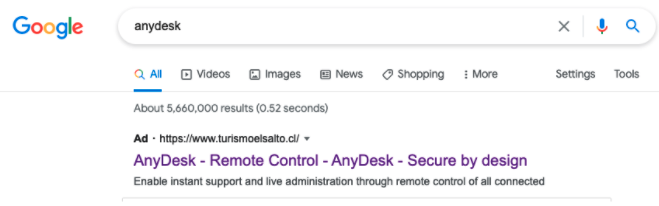

# Sichere Quellen

Das Herunterladen von Dateien gehört heute zum digitalen Alltag – sei es Software, Dokumente, Bilder oder Lernmaterialien. Gleichzeitig ist nicht jede Datei im Internet vertrauenswürdig. Eine sichere Softwarequelle stellt sicher, dass Programme unverändert, authentisch und frei von Manipulationen bereitgestellt werden – sowohl während des Downloads als auch bei der späteren Nutzung. Unsichere oder gefälschte Quellen können hingegen Schadsoftware verbreiten, die Geräte infiziert oder persönliche Daten abgreift.

Ein besonders relevantes Beispiel für solche Angriffe ist **Malvertising**. Dabei missbrauchen Angreifer legitime Werbeplattformen wie Google Ads, um Nutzer auf manipulierte oder schädliche Webseiten zu leiten. Diese Anzeigen erscheinen häufig oberhalb der echten Suchergebnisse und wirken dadurch seriös. Nutzer verbinden solche Anzeigen intuitiv mit geprüften oder offiziellen Inhalten – ein Vertrauen, das Angreifer gezielt ausnutzen.

Typischerweise kaufen Cyberkriminelle Werbeanzeigen für Suchbegriffe populärer Software wie „AnyDesk Download“, „VLC Player“ oder „PDF‑Reader“. Die Anzeige führt jedoch nicht zur echten Herstellerseite, sondern zu einer täuschend echt gestalteten Fake‑Webseite, auf der ein vermeintlich offizielles Installationsprogramm angeboten wird, das in Wirklichkeit Schadsoftware enthält.

---

## Dateien ausschließlich von vertrauenswürdigen Webseiten herunterladen

Dateien sollten grundsätzlich nur von offiziellen und seriösen Quellen bezogen werden.  
Solche Plattformen halten definierte Sicherheitsstandards ein und prüfen bereitgestellte Inhalte vor der Veröffentlichung.

1. **Betriebssystem-App-Stores**  
   (z. B. Microsoft Store, Mac App Store, Google Play Store)  
   *Vorteil:* Anwendungen werden vor der Veröffentlichung durch den Plattformbetreiber überprüft.

2. **Offizielle Herstellerseiten**  
   (z. B. `videolan.org`, `microsoft.com`)  
   *Vorteil:* Die Software stammt direkt vom Entwickler und ist daher am zuverlässigsten.

Das sorgt in der Regel dafür, dass es sich tatsächlich um die Software des Entwicklers handelt und sie nicht manipuliert wurde. Das bedeutet jedoch nicht, dass der Entwickler keinen Schaden anrichten möchte. App-Stores haben hier sicherlich eine Gatekeeper-Funktion und versuchen, solche Dinge zu verhindern. Auf Herstellerwebseiten kann jedoch grundsätzlich alles angeboten werden, was entwickelt werden kann.

---

## Beispiel: Download von AnyDesk

Ein Nutzer sucht im Internet nach „AnyDesk“.

  
*Abbildung: Malicious Google Ads – manipulierte Werbeanzeige oberhalb der echten Suchergebnisse*

Die erste Anzeige ist ein durch Google Ads ausgespielter Malvertising‑Link.  
Beim Anklicken wird nicht die echte AnyDesk‑Software, sondern wird eine Schadsoftware  heruntergeladen.

---

## Beispiel: Download des VLC Media Players

Bei der Suche nach „VLC Player“ erscheinen in Suchmaschinen häufig mehrere Ergebnisse:

1. https://www.videolan.org  
2. https://en[.]vlc[.]de/

Für Nutzer stellt sich die Frage, welche Seite die offizielle und sichere Quelle ist.

  
*Abbildung: Offizielle VLC‑Projektseite*

  
*Abbildung: Alternative, nicht offizielle VLC‑Seite*

### Schritt 1: Suchergebnisse kritisch prüfen

Suchmaschinen zeigen häufig bezahlte Anzeigen an.  
Diese sind mit „Anzeige“ gekennzeichnet und können auf gefälschte Webseiten führen.

**Empfehlung:**  
- Domain exakt prüfen

### Schritt 2: Domain und Betreiber kontrollieren

Die offizielle Projektseite von VLC lautet:

`https://www.videolan.org`

Achten Sie auf korrekte Schreibweise der Domain, ein seriöses Impressum und fehlende Weiterleitungen auf fremde Server.

### Schritt 3: HTTPS richtig einordnen

Das Schloss-Symbol (HTTPS) bedeutet lediglich, dass die Verbindung verschlüsselt ist.  
Es garantiert **nicht**, dass die angebotene Datei vertrauenswürdig ist.

Wichtig:

- Auch gefälschte Seiten können HTTPS nutzen.  
- `mircosoft.com` wirkt ähnlich wie `microsoft.com`, ist aber eine andere Domain.  

HTTPS schützt nur davor, dass Daten während der Übertragung manipuliert werden oder Dritte in öffentlichen Netzwerken mitlesen können.

### Schritt 4: Download-Link prüfen

Gerade bei Installationsdateien sollte zusätzlich kontrolliert werden:

- Beginnt der Download mit `https://`?  
- Erfolgt eine Weiterleitung auf unbekannte Server?  
- Stammt die Datei nachweislich vom Hersteller?  

Wirkt eine Webseite ungewöhnlich oder verdächtig, sollte kein Download durchgeführt werden.

---

## Sicherheitsfunktionen moderner Webbrowser

Moderne Webbrowser verfügen über integrierte Schutzmechanismen gegen schädliche Downloads. Sie überprüfen Dateien automatisch und ordnen sie je nach Risiko ein:

- **Sichere Dateien:** Werden ohne Einschränkung zugelassen.  
- **Schädliche Dateien:** Werden blockiert.  
- **Potenziell riskante Dateien:** Erfordern eine bewusste Bestätigung durch den Nutzer.  

Diese Funktionen helfen dabei, Risiken zu minimieren, ohne die Kontrolle über eigene Downloads zu verlieren.

---

## Praktisches Beispiel aus dem Alltag

> Ein Student benötigte kurzfristig einen PDF‑Reader für eine Abgabe und suchte online nach einer passenden Software. Das erste Suchergebnis wirkte professionell und bot einen kostenlosen Download an. Kurz nach der Installation wurde der Computer deutlich langsamer, und unerwünschte Pop‑ups erschienen.  
> Was wie ein harmloses Programm aussah, hatte im Hintergrund zusätzliche Software installiert.  
> Diese Situation hätte vermieden werden können, wenn die Echtheit der Website überprüft und auf eine sichere Download‑Verbindung geachtet worden wäre.

Dieses Beispiel zeigt, dass selbst alltägliche Downloads ein Risiko darstellen können, wenn grundlegende Sicherheitsregeln nicht beachtet werden.

---

## Quellen und weiterführende Informationen

Die Inhalte dieses Leitfadens orientieren sich an anerkannten Sicherheitspraktiken und Empfehlungen zur Bewertung sicherer Downloads. Eine ausführliche Darstellung stellt Microsoft im folgenden Leitfaden zur Verfügung:

1. https://www.microsoft.com/en-us/edge/learning-center/how-to-check-if-a-file-is-safe-to-download

2. https://www.crowdstrike.com/en-us/blog/falcon-complete-disrupts-malvertising-campaign-targeting-anydesk/
