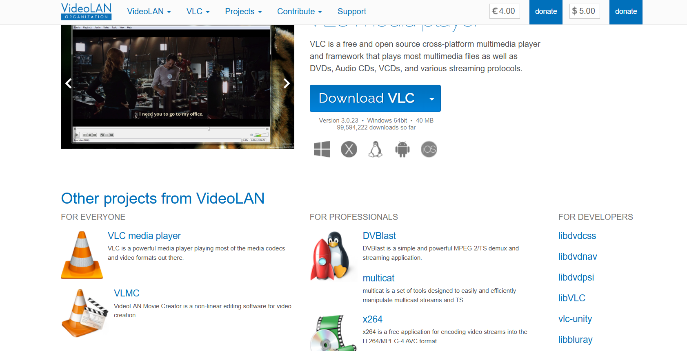
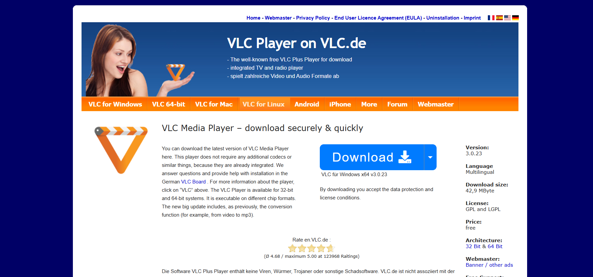

# Sichere Quellen

Das Herunterladen von Dateien gehört heute zum Alltag – sei es Software, Dokumente, Bilder oder Lernmaterialien. Allerdings ist nicht jede Datei im Internet vertrauenswürdig. 

Eine sichere Softwarequelle stellt sicher, dass Programme unverändert, authentisch und vor Manipulation oder Beschädigung geschützt sind – sowohl während des Downloads als auch bei der Nutzung. 

Unsichere Downloads können Schadsoftware enthalten, die darauf ausgelegt ist, Geräte zu infizieren oder persönliche Daten zu stehlen.

## 1. Dateien ausschließlich von vertrauenswürdigen Webseiten herunterladen

Dateien sollten nur von offiziellen und seriösen Quellen bezogen werden.  
Offizielle Plattformen halten in der Regel definierte Sicherheitsstandards ein und prüfen bereitgestellte Inhalte vor der Veröffentlichung.

1. **Betriebssystem-App-Stores**  
   (z. B. Microsoft Store für Windows-Anwendungen, Mac App Store, Google Play Store)  
   *Vorteil:* Anwendungen werden vor der Veröffentlichung durch den Plattformbetreiber überprüft.

2. **Offizielle Herstellerseiten**  
   (z. B. `videolan.org`, `microsoft.com`)  
   *Vorteil:* Die Software wird direkt vom Entwickler bereitgestellt und kontrolliert.

---

## 2. Beispiel: Download des VLC Media Players

Bei der Suche nach „VLC Player“ erscheinen in Suchmaschinen häufig mehrere Ergebnisse:

1. https://www.videolan.org  
2. https://en.vlc.de/

Für Nutzer stellt sich die Frage, welche Seite die offizielle und sichere Quelle ist.

### Schritt 1: Suchergebnisse kritisch prüfen

Suchmaschinen zeigen häufig bezahlte Anzeigen an.  
Diese sind mit „Anzeige“ gekennzeichnet und können auf gefälschte Webseiten führen.

Empfehlung:

- Domain exakt prüfen  

### Schritt 2: Domain und Betreiber kontrollieren

Die offizielle Projektseite von VLC lautet:

`https://www.videolan.org`

Achten Sie auf korrekte Schreibweise der Domain, seriöses Impressum  oder Weiterleitungen auf fremde Server  

### Schritt 3: HTTPS richtig einordnen

Das Schloss-Symbol (HTTPS) bedeutet nur, dass die Verbindung verschlüsselt ist.  
Es garantiert nicht, dass die angebotene Datei vertrauenswürdig ist.

Wichtig:

- Auch eine gefälschte Seite kann HTTPS nutzen.  
- `mircosoft.com` wirkt ähnlich wie `microsoft.com`, ist aber eine andere Domain.  

HTTPS schützt lediglich davor, dass Daten während der Übertragung manipuliert werden oder dass, dritte in öffentlichen Netzwerken mitlesen können  

### Schritt 4: Download-Link prüfen

Gerade bei Installationsdateien sollte zusätzlich kontrolliert werden. Beginnt der Download mit `https://`?. Erfolgt keine Weiterleitung auf unbekannte Server?. Stammt die Datei direkt vom Hersteller?  

Wirkt eine Webseite ungewöhnlich oder verdächtig, sollte kein Download durchgeführt werden.

---

## 3. Sicherheitsfunktionen Ihres Webbrowsers

Moderne Webbrowser verfügen über integrierte Schutzmechanismen gegen schädliche Downloads. Sie überprüfen Dateien automatisch und ordnen sie je nach Risiko ein:

- **Sichere Dateien:** Werden ohne Einschränkung zugelassen.  
- **Schädliche Dateien:** Werden blockiert.  
- **Potenziell riskante Dateien:** Erfordern eine bewusste Bestätigung durch den Nutzer.  

Diese Funktionen helfen dabei, Risiken zu minimieren, ohne die Kontrolle über eigene Downloads zu verlieren.

---

## 4. Praktisches Beispiel aus dem Alltag

Um die Risiken unsicherer Downloads besser zu veranschaulichen, hilft ein kurzes Beispiel aus dem Alltag:

> Ein Student benötigte kurzfristig einen PDF-Reader für eine Abgabe und suchte online nach einer passenden Software. Das erste Suchergebnis wirkte professionell und bot einen kostenlosen Download an. Kurz nach der Installation wurde der Computer deutlich langsamer, und unerwünschte Pop-ups erschienen.  
> Was wie ein harmloses Programm aussah, hatte im Hintergrund zusätzliche Software installiert.  
> Diese Situation hätte vermieden werden können, wenn die Echtheit der Website überprüft und auf eine sichere Download-Verbindung geachtet worden wäre.

Solche Beispiele zeigen, dass selbst alltägliche Downloads ein Risiko darstellen können, wenn grundlegende Sicherheitsregeln nicht beachtet werden.

---

## Quellen und weiterführende Informationen

Die Inhalte dieses Leitfadens orientieren sich an anerkannten Sicherheitspraktiken und Empfehlungen zur Bewertung sicherer Downloads. Eine ausführliche Darstellung stellt Microsoft in folgendem Leitfaden zur Verfügung:

- Microsoft Learning Center: *How to check if a file is safe to download*  
  https://www.microsoft.com/en-us/edge/learning-center/how-to-check-if-a-file-is-safe-to-download
