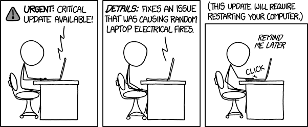
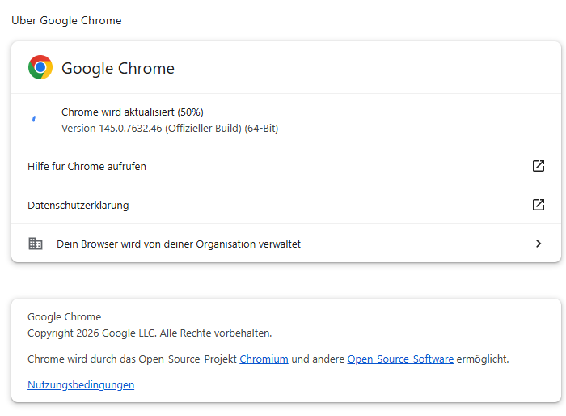
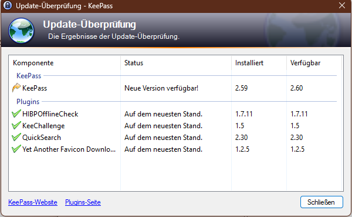

# Software-Updates

## Einleitung

Der [Software-Hygiene-Teil]() hat uns gezeigt, warum es wichtig ist, eine möglichst kleine Angriffsfläche zu bieten. Für die produktive Nutzung eines Laptops, PCs oder Smartphones ist jedoch zusätzliche Software nötig. Doch wie geht man mit dieser Software um?
Apps, Programme und Betriebssysteme auf dem aktuellen Stand zu halten, ist eine der wichtigsten Maßnahmen, um die IT-Sicherheit zu verbessern. Denn Updates schließen bekannte Schwachstellen, die sonst von Angreifern ausgenutzt werden können. Trotzdem werden Patches oft verzögert installiert – aus Unwissenheit, Misstrauen oder Bequemlichkeit. Deshalb soll es hier darum gehen, warum regelmäßige Aktualisierungen wichtig sind, wie Updates kommuniziert werden und welche Update-Strategien Hersteller nutzen, um Updates an Anwender zu verteilen.

## Grundproblem

Sehr viele Menschen unterschätzen den Nutzen von Software-Updates. Sicherheitsexpert:innen sehen das zeitnahe Einspielen von Sicherheitsupdates als eine der effektivsten Schutzmaßnahmen an – sogar noch vor Passwortmanagern und der Zwei-Faktor-Authentifizierung. So kommt es eben dazu, dass teilweise erst 50 % der Anwender das Update innerhalb einer Woche nach der Veröffentlichung durchführen, obwohl nach dem Veröffentlichen des Updates häufig die Angriffsraten auf die in dem Update verbesserte Schwachstelle stark ansteigen.

> Aus [““...No one Can Hack My Mind”: Comparing Expert and Non-Expert Security Practices, Ion et al.](https://www.usenix.org/system/files/conference/soups2015/soups15-paper-ion.pdf)

> https://www.verbraucherzentrale.nrw/wissen/digitale-welt/apps-und-software/softwareupdates-deshalb-sind-sie-wichtig-81285

## Gründe für Verzögerungen

Aber aus welchen Gründen werden Updates nicht zeitnah eingespielt? Einige Studien haben dies untersucht und folgende Hauptthemen herausgearbeitet[^1][^2]:

- **Unklarer Nutzen**: Wie oben bereits erklärt, ist vielen der Nutzen eines Updates gar nicht bewusst. Häufig wird ein Update nur wegen der neuen Funktionen installiert, nicht aber, weil die Sicherheit verbessert wurde.
- **Angst vor Problemen**: Zudem könnten Updates auch schädliche Inhalte mitliefern bzw. neue Fehler beinhalten.
- **Unverständlicher Prozess**: Bei vielen Anwendungen ist nicht ersichtlich, welche Änderungen ein Update mitbringt bzw. wieso dieses Update jetzt installiert werden soll.
- **Manuelle Abläufe**: Eine fehlende Automatisierung des Update-Prozesses ist teilweise herausfordernd für die Anwender:innen und bietet zudem Möglichkeiten für Angreifer:innen (siehe [Quellen]())

> https://xkcd.com/1328/

## Konkrete Folgen (Beispiele)

Doch was kann passieren, wenn Updates nicht eingespielt werden und somit Sicherheitslücken weiterhin vorhanden sind?
Hierfür gibt es unzählige Beispiele. Wir betrachten hier konkret zwei Fälle, die auch private Rechner betrafen.

### EternalBlue und WannaCry

EternalBlue ist eine Schwachstelle im SMB-Protokoll, die 2017 bekannt wurde (CVE-2017-0144). Sie wurde von der Schadsoftware WannaCry massenhaft ausgenutzt und infizierte weltweit Hunderttausende Rechner, darunter Krankenhäuser und Unternehmen. Dabei wird eine Lücke in dem alten Dienst SMBv1 unter Windows ausgenutzt, der eigentlich dazu dient, Dateien und Drucker im Netzwerk zu teilen. Zwar hatte Microsoft schnell einen Patch veröffentlicht, der das Problem behebt, doch viele Organisationen hatten diesen nicht installiert [^1].

Ein ausführliches Video über die Hintergründe und Auswirkungen von Computerphile findet sich hier: [Youtube Computerphile | Wana Decrypt0r (Wanacry Ransomware)](https://www.youtube.com/watch?v=88jkB1V6N9w)

### WinRAR

RARLAB, Public domain, via Wikimedia Commons

WinRAR ist ein Packprogramm, das auf vielen Windows-Rechnern installiert ist. Daher ist es immer wieder das Ziel von Angriffen. Zuletzt bzw. immer noch wird eine Schwachstelle ausgenutzt, die es Angreifern ermöglicht, über speziell präparierte Dateien (z. B. PDFs) in den Ordner für die Startprogramme zu schreiben und dort eine Malware zu platzieren, die beim nächsten Login automatisch gestartet wird. Diese Sicherheitslücke mit dem Namen CVE-2025-8088 besteht bereits seit Mitte 2025 und wurde im selben Monat gepatcht. Dennoch wird sie Ende Januar von verschiedenen Akteuren weiterhin ausgenutzt[^2].

https://www.youtube.com/watch?v=rkMNOC8fhUQ

# Updates besser verstehen

## Was ist ein Update?

Gehen wir noch einen Schritt zurück und schauen uns an, was ein Update ist:
Ein Update ist eine Änderung einer Software, die das Ziel verfolgt, diese zu modernisieren und auf den neuesten Stand zu bringen. Dies wird erreicht, indem Fehler behoben, Funktionen ergänzt und/oder Sicherheitslücken geschlossen werden. Entwickler:innen veröffentlichen in der Regel zu jedem Patch bzw. Update **Changelogs** oder **Release Notes**, die die Änderungen in Kategorien wie „Neu”, „Verbesserungen”, „Fehlerbehebungen” und „Sicherheit” auflisten. Changelogs mit sicherheitsrelevanten Einträgen sind besonders zeitkritisch. Diese Hinweise können dabei helfen, die Änderungen durch ein Update zu verstehen[^3].

## Changelog-Beispiel

**[3.2.0] – 2026‑01‑01**

**Neu**

- Dark Mode für eine bessere Nutzung am Abend.
- Überarbeitete Startseite mit schnellerem Zugriff auf Favoriten.

**Verbesserungen**

- Schnellere Synchronisierung zwischen Geräten.
- Optimierte Push-Benachrichtigungen.

**Fehlerbehebungen**

- Doppelanzeige von Benachrichtigungen behoben.
- Absturz beim Öffnen der Einstellungen wurde korrigiert.

**Sicherheit**

- Aktualisierung einer internen Netzwerkbibliothek zur Behebung der Schwachstelle CVE‑2025‑12345.
- Verbesserte Prüfungen bei der Anmeldung.

(Dieses Beispiel ist fiktiv.)

Weitere Beispiele von echten Softwareprojekten sind [hier]() zu sehen.

## Sicherheitsupdates versus Funktionsupdates

- **Sicherheitsupdates**:Diese schließen Schwachstellen und Sicherheitslücken und sollten so schnell wie möglich installiert werden.
- **Funktionsupdates** bringen neue Features. Sie sind grundsätzlich auch wichtig, jedoch meist weniger zeitkritisch.

**Weil Releases jedoch häufig beides kombinieren und keine Wahl lassen, gilt: Alle Updates sollten zeitnah geprüft und installiert werden.**

## Wie Updates verteilt werden

### Vollautomatische Updates

Die Anwendung prüft im Hintergrund auf Updates und installiert sie automatisch. Lediglich ein Neustart, der Anwendung oder ggf. des Computers ist möglich. Dies passiert aber, wenn die Anwendung so oder so geschlossen wird oder der PC sowieso heruntergefahren wird.

### Halbautomatische Updates

Die Software meldet ein verfügbares Update und fragt nach Bestätigung für die Installation oder einen Neustart. Der Vorteil hierbei ist, dass man die Möglichkeit hat, das Update zu unterdrücken bzw. zurückzustellen. Das kann jedoch dazu führen, dass sich ein Update immer weiter verzögert.

Ein typisches Beispiel hierfür sind die Windows Updates. Updates werden im Hintergrund heruntergeladen. Für die Installation ist aber in der Regel die aktive Auswahl des Nutzers nötig.

### Manuelle Online-Updates

Nutzer:innen starten die Update-Suche in den Einstellungen und bestätigen Downloads manuell. Problematisch hierbei ist, dass diese Funktion bekannt sein muss und die Nutzer:innen immer wieder nach neuen Versionen suchen müssen. Wenn nicht bekannt ist, in welchen Zeiträumen die Entwickler:innen neue Versionen bereitstellen, kann es auch hier zu langen Verzögerungen beim Einspielen des Updates kommen.

### Manuelle Offline‑Updates

Updates werden nur auf der Herstellerwebseite bereitgestellt; Nutzer:innen müssen wissen, dass es ein Update gibt, hierfür muss aber auch bekannt sein, um auf welcher Seite das überprüft werden kann und zudem muss man peridoisch daran denken nach diesen zu suchen.

## Worüber Updates kommen

### Interne Update-Mechanismen

Einige Hersteller oder Anbieter verteilen Updates direkt über eigene Server oder Management-Tools. Je nach Implementierung bzw. Umsetzung werden Updates automatisch installiert oder müssen manuell angestoßen werden. In Betriebssystemen ist es üblich, dass Updates über einen integrierten Updater bzw. über die Einstellungen aktualisiert werden können.

### App Stores

Stores wie der Google Play Store, der App Store von Apple, der Microsoft Store oder der Mac App Store verwalten die Installation und Aktualisierung vieler Apps zentral. Auch hier werden Updates wahlweise automatisch oder manuell installiert. In der Regel wird man jedoch immer informiert.

### Herstellerwebseiten

Treiber oder Software kleiner Entwicklerteams werden häufig nur auf den Herstellerwebseiten zur Verfügung gestellt. Zwar erhält man die Software hier direkt von der Quelle, jedoch können Angreifer bzw. Kriminelle versuchen, Benutzer auf eine falsche Seite zu locken, die eine modifizierte Software enthält, die Schaden anrichten kann.

### Paketmanager

Unter Linux sind Paketmanager wie apt, yum, dnf oder zypper Standard, um Software zu verwalten. Diese werden dort häufig über das Terminal bedient, einige Distributionen bieten jedoch auch eine Benutzeroberfläche, über die Updates und Installationen komfortabel verwaltet werden können. Ein vergleichbares Tool gibt es unter Windows seit einigen Jahren mit **winget**[^4]. Diese ist direkt von Microsoft und bietet den Vorteil, dass Anwendungen von Microsoft überprüft werden. Dies ist jedoch nicht perfekt und auch über diese können theoretisch Schadprogramme verteilt werden. Nichtsdestotrotz bieten sie eine Aktualisierung von Software, ohne dass diese geöffnet werden muss. Vergleichbares, wenn auch nicht so mächtig, findet sich für macOS mit **Homebrew**[^5].

## Übersicht Updateverteilung

| Quelle             | Mechanismus                                    | Beispiele                               | Vorteile                   | **Empfehlung**                                                                                                         |
| ------------------ | ---------------------------------------------- | --------------------------------------- | -------------------------- | ---------------------------------------------------------------------------------------------------------------------- |
| Betriebssystem     | automatisch; halbautomatisch; Manuell          | Windows Update, macOS Softwareupdate    | Deckt OS‑Sicherheitslücken | **Automatische Updates prüfen/anschalten**                                                                             |
| App Store          | automatisch; halbautomatisch                   | Google Play, App Store, Microsoft Store | Zentrale Verwaltung        | **Automatische App‑Updates aktivieren**                                                                                |
| In‑App Updater     | automatisch; halbautomatisch; Benachrichtigung | Browser, PDF‑Reader, Spiele             | Schnelle Verfügbarkeit     | **Regelmäßig nach Updates suchen und installieren**                                                                    |
| Herstellerwebseite | manuell; halbautomatisch                       | Grafikkartentreiber, Spezialsoftware    | Direkt vom Hersteller      | **Nur offizielle Downloads verwenden**                                                                                 |
| Paketmanager       | automatisch; halbautomatisch                   | apt, winget, Homebrew                   | Batch‑Updates              | **Nur für technisch Interessierte/Versierte geeignet** (Tools wie **UnigetUI** vereinfachen die Nutzung unter Windows) |

## Empfehlungen

Was sollte man nun konkret umsetzen, um die Software möglichst schnell zu aktualisieren?

- [ ] **Vollautomatik priorisieren**: Überall dort wo es möglich ist automatische Updates aktivieren. Gilt insbesondere für das Betriebssystem und Browser (die Update-Funktion lässt sich dort bei den meisten heutzutage kaum noch deaktivieren).
- [ ] **App-Stores nutzen**: In Stores wie den Apple App Store, den Google Play Store oder der Microsoft Store automatische Aktualisierungen aktivieren und verwenden. Hierdurch werden eine Vielzahl von Programmen und aufwand gepflegt.
- [ ] **Blick in die "zweite Reihe"**: Es sollte peridoisch geprüft geziehlt Geräte und Software geprüft werden, die sich nicht von selbst melden:
  - Browser-Add-ons
  - Router-Firmware & Smart-Home-Geräte(IoT / Lampen, Saugroboter, ...).
  - Spezialprogramme (z. B. Grafiktreiber, Packprogramme wie WinRAR/7-Zip oder Bibliotheken, wie die Java Runtime Environment)
- [ ] **Sichere Quellen wählen**: Für manuelle Updates ausschließlich die Offiziellen Herstellerwebseiten nutzen. Siehe hierzu den nächsten Abschnitt: [Sichere Quellen]().

[^1]: https://www.heise.de/news/EternalBlue-Hunderttausende-Rechner-ueber-alte-NSA-Schwachstelle-infizierbar-4167918.html

[^2]: https://www.heise.de/news/Angriffe-auf-WinRAR-Luecke-laufen-weiter-11157132.html

[^3]: https://en.wikipedia.org/wiki/Software_update

[^4]: https://learn.microsoft.com/de-de/training/modules/explore-windows-package-manager-tool/4-update-software

[^5]: https://docs.brew.sh/FAQ#how-do-i-update-my-local-packages
