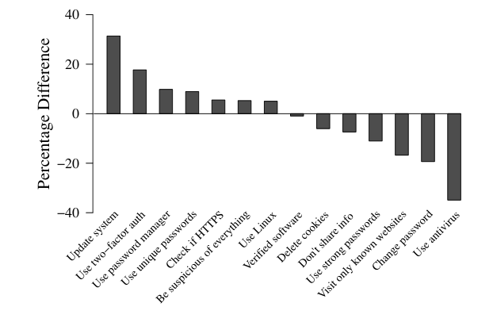

# Software Updates

## Grundproblem
In der [Software Hygiene]() wurde bereits dargelegt, warum es schlecht ist möglichst viel Software auf verschiedenen Geräten zu haben. Jedoch können wir natürlich nicht nur mit einem blanken Betriebssystem ohne Anwendungen produktiv arbeiten. Doch wie arbeitet man mit der Software weiter die dann tatsächlich auf dem Endgerät bleiben soll. 

Es ist hier wichtig diese, sobald eine Aktualisierung veröffentlicht wurde diese zu installieren.

Nach Experten ist das die wichtigste Maßnahme um Sicherheit zu gewärhleisten, noch vor der Nutzung eines Passwortmanagers und der Aktivierung vom 2-Faktor. Diese Aussage stammt aus einer Studie bei der Sicherheitsexperten und Laien über die effektivität von möglichen Umsetzungen befragt wurden. Das spannende aus dieser Studie ist, dass die meisten Laien diese Methode als nicht effektive.

BILD UNTERSCHIED ODER VERGLEICH VON DER STUDIE EINFÜGEN.
asda